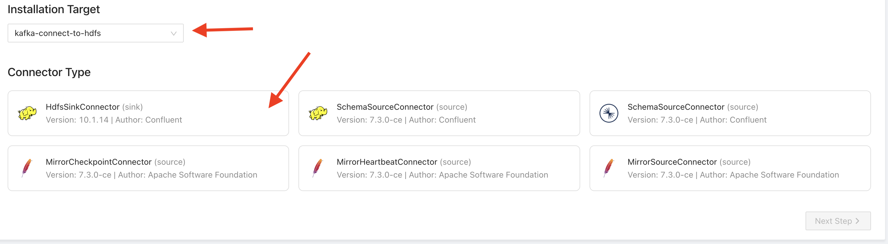

# SemesterprojektE22

## How to start


Setup Kafka Connect (one time only)

1. Run ```docker compose up``` in the root directory.

This will make a source folder. The source folder is where Flume takes the files from i.e. where to upload files for streaming.

2. Go to ```localhost:8000``` for the kowl website, and go to the kafka connect tab on the left hand side
3. Click on the blue create connector button

   
4. Choose kafka-connect-to-hdfs installation target and HdfsSinkConnector as the connector type

   
5. Choose a connector name and flush size (it will be overriden anyway so doesn't matter what it is) and scroll all the way to the bottom and click on the blue next step button
6. Override the connector properties so it looks like:

   ```json
   {
       "name": “kafka-to-hdfs”,
       "connector.class": "io.confluent.connect.hdfs.HdfsSinkConnector",
       "tasks.max": 3,
       "key.converter": "org.apache.kafka.connect.storage.StringConverter",
       "topics": "events",
       "hdfs.url": "hdfs://namenode:9000/stream/",
       "format.class": "io.confluent.connect.hdfs.string.StringFormat",
       "flush.size": 1
   }

   ```

Setup Hive (must be done every time there is a restart):

1. Enter the hive container with ```docker exec -it <container_id or name of hive_server> /bin/bash```
2. Run ```hive -f hive_table_setup.hql```


After this, everything should be setup. To run queries on the data that comes through the source folder, you will need to make sure that you specify ```USE DATABASE semester_project```. The table is called ```push_events```.

Data should automatically be published into the table after it is pushed through flume to kafka to HDFS.

## How to test

Upload the json files into the source folder and it should be automatically put into the Kafka topic 'events' and moved to the stream folder of the HDFS
